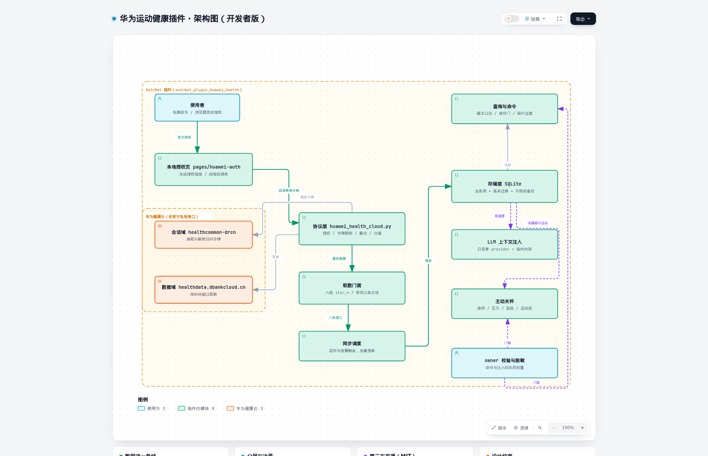

# 开发与维护说明



架构一句话：插件在服务端轮询华为健康云的非官方私有接口，把六类生活数据整形后落进本地 SQLite，再由查询命令、LLM 上下文注入与主动关怀三条路径消费；所有对外出口统一过 owner 校验与隐私闸门，协议层止于 adapters/，存储层是唯一写入点。

本文面向维护者。用户请先读 [README](../README.md)。

---

## 一、插件定位

- 数据来自华为运动健康**云端已同步的历史记录**，插件只做服务端读取，不连接蓝牙设备、不做实时监护、不构成医疗诊断。
- 不依赖手机端 App 常驻；但账号必须先在手机上把数据同步到云端，插件才读得到。
- 授权走一次性的浏览器回跳（`hms://` 回调串），之后由 refresh token 长期维持。

## 二、代码架构

| 目录 | 职责 | 边界 |
| --- | --- | --- |
| `adapters/` | 华为云协议、数据整形、取数门面、异常体系 | **不碰数据库**；协议层移植自上游，仅追加异步门面与中文区主机常量 |
| `storage/` | 表结构定义、版本迁移链、读写门面、归一函数 | 全项目**唯一写库点**；迁移失败必须回滚并显式报错 |
| `services/` | 同步调度、按需刷新、主动关怀规则层 | 只依赖 adapters 与 storage，不依赖命令层 |
| `features/` | LLM 上下文注入、主动关怀编排 | 纯逻辑优先，框架依赖放在 `try/except` 里 fail-closed |
| `commands/` | 命令解析与展示渲染 | 只管渲染与门禁，不直接取数、不直接写库 |
| `pages/` | 插件配置页里的授权页（生成链接 / 回收回调串） | 页面只调后端，不写绝对路径 |
| `scripts/` | 自检脚本（12 份） | 全部离线可跑，真连云端那份单独标注 |

入口 `main.py` 只负责装配：配置读取、生命周期钩子、命令注册、后台循环启停；具体逻辑一律下沉到上述模块。

## 三、数据与同步

- 六类数据：日汇总活动、心率日值、睡眠（含入睡/起床时间与白天小睡）、压力、血氧、训练会话。
- 同步有两种触发：**定时**（默认 60 分钟）与**对话按需**（默认 15 分钟节流）；两者共用同一套取数与落库路径。
- 写入语义为幂等 upsert：同一天重复同步结果一致，未提供的列不会被写成空值。
- **训练碎片过滤**：时长不足 3 分钟且距离不足 300 米（默认，可配）的记录视为碎片，仍入库并打标记，但不出现在命令展示、LLM 摘要与主动关怀里。
- 存储层带**版本迁移链**：`schema_version` 记录当前版本，升级前自动在同目录生成带时间戳的备份；迁移中途失败回滚且抛错，绝不半迁移；库版本高于插件支持的版本时拒绝打开。

## 四、并发与失败处理

- 连接、同步、诊断共用一把操作锁；对话触发的刷新会合并为单个后台任务，忙碌时直接用缓存，不排队。
- 云端读取设有多层上限：单响应字节、数据集累计字节、记录条数与整体时限；`429` 会建立跨数据集冷却。
- 取数失败按三类分流：**认证类**触发重登提醒与暂停自动同步；**网络类**下轮重试；**解析类**只降级该类，不影响其余类别。
- 「云端没有这类数据」与「取数失败」是两条独立路径，前者记「无」并照常展示，后者才计入失败。

## 五、权限与隐私

- 所有入口同时校验使用者 UID、Bot ID 与私聊消息类型；群聊不返回任何健康数据。
- 健康数据默认**不外送**：写入 LLM 上下文需要显式打开开关，且仅当本轮实际使用的 provider 在信任名单内才注入；名单为空即永不注入。
- 注入内容作为**临时内容**附加在本轮请求上，不进入长期会话历史；链路中任何一步失败都退化为「不带健康数据的普通回答」，不报错、不中断聊天。
- 主动关怀只在已绑定的主人私聊里发送；发送前经过去重、场景冷却、每日上限与（仅夜间的）模型判断闸门。
- 日志与用户可见错误一律脱敏：令牌、UID 不回显；健康数值不进日志。

## 六、配置页约定

- 分组：账号与凭证、同步节奏、本地存储、隐私、主动关怀。
- 需要用户选择的模型使用框架原生选择器（多选 provider 名单），不要求手填 id。
- 主动关怀为二级结构：总开关关闭时四个场景项不显示；某场景开关关闭时它的阈值也不显示。
- 关怀相关项**出厂默认全部关闭**。

## 七、自检

```bash
python3 scripts/import_check.py            # 静态 import 与实例化
python3 scripts/selftest_migrations.py     # 迁移链：新库建到最新版 / 幂等 / 旧库无损升级 / 备份 / 失败回滚
python3 scripts/selftest_storage.py        # 建表、写入幂等、单位与时区归一
python3 scripts/selftest_commands.py       # 命令渲染与身份门
python3 scripts/selftest_privacy.py        # 隐私闸门、脱敏、提醒
python3 scripts/selftest_ondemand.py       # 按需刷新节流
python3 scripts/selftest_webapi.py         # 授权页后端与配置回写
python3 scripts/selftest_protocol.py       # 协议层（真连云端，只读）
python3 scripts/selftest_network_retry.py  # 重试与退避
python3 scripts/selftest_facade.py         # 取数门面与异常分流
python3 scripts/selftest_llm_injection.py  # 注入链：白名单、降级、临时内容
python3 scripts/selftest_care.py           # 主动关怀四场景与护栏
python3 scripts/selftest_sync.py           # 端到端同步一轮（真连云端）
```
- 除后两份外均可离线跑；离线脚本一律使用临时库，不触碰真实数据。
- 改动存储或规则层后，至少跑：`selftest_migrations`、`selftest_storage`、`selftest_care`、`selftest_commands`。

## 八、已知边界与设计取舍

- **心率与睡眠只有日汇总**：华为侧不提供样本级/会话级明细，展示按汇总口径降级，不推算、不拆分分钟数。
- **身体测量无数据源**：相关能力下线，不落库也不展示。
- **不使用框架私有方法**：不注入 runner 补丁；只用公开钩子（`@filter.on_llm_request` 等）。
- **训练分钟段可能不完整**：云端只上传部分分钟段时，时长与距离会偏小，属于数据源限制而非解析缺陷。

## 九、第三方来源

- `adapters/` 下的协议层移植自 [and7ey/huawei_health](https://github.com/and7ey/huawei_health)（MIT），仅追加异步门面与中文区主机常量；许可全文见 `LICENSE-and7ey-huawei_health.txt`。
- 主动关怀的三段提示词文案复用自 `astrbot_plugin_mi_fitness_health`（MIT, Aleksej Kubulashvili）；许可全文见 `LICENSE-astrbot_plugin_mi_fitness_health.txt`。
- 详细声明见 `NOTICE`。

## 十、发布

1. 跑完全部自检，确认真连云端那份通过。
2. 更新 `metadata.yaml` 的版本号；必要时在 README 的更新日志补一条。
3. 确认 `git ls-files | grep -Ei "\.db|token"` 为空，再提交与推送。
